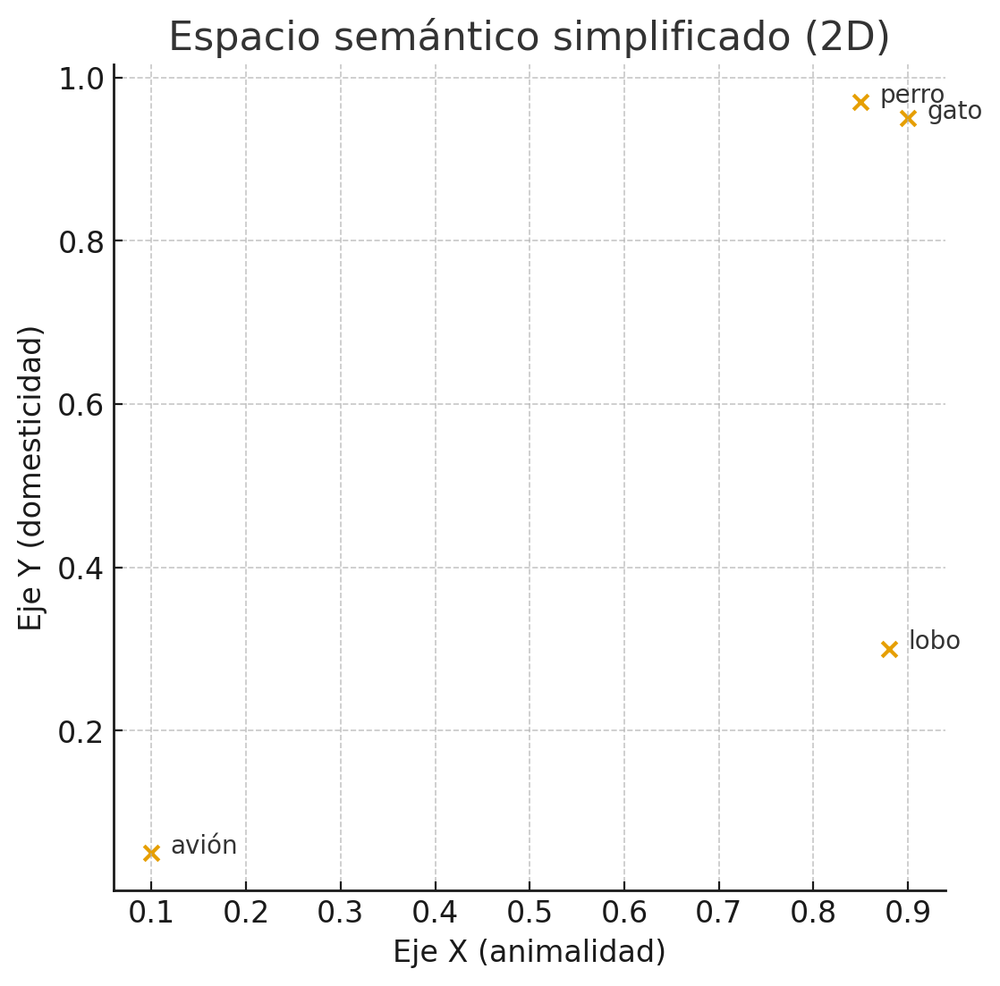
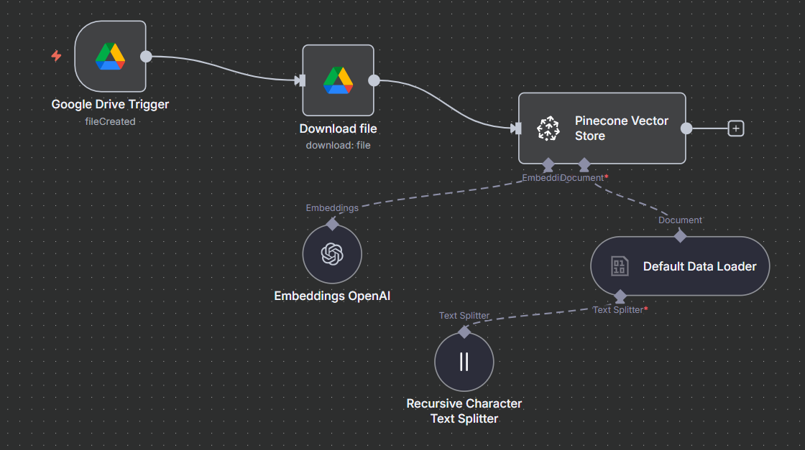

```{r load_packages, message=FALSE, warning=FALSE, include=FALSE}
library(fontawesome)
```

# Enlaces

-   `r fa("message", fill = "steelblue")` segana\@fen.uchile.cl
-   `r fa("computer", fill = "steelblue")` <https://segana.netlify.app>
-   `r fa("linkedin", fill = "steelblue")` <https://www.linkedin.com/in/sebastian-egana-santibanez/>
-   `r fa("github", fill = "steelblue")` <https://github.com/sebaegana>

------------------------------------------------------------------------

# Módulo 03

## Clase 01: Arquitectura y funcionamiento de los LLMs

### De los conceptos base al panorama actual de modelos

------------------------------------------------------------------------

## Objetivo de la sesión

-   Entender cómo procesan lenguaje los LLMs
-   Revisar tokens, embeddings, atención, contexto y parámetros
-   Distinguir modelos abiertos, cerrados y open-weight
-   Comparar familias como GPT, Claude, Gemini y Llama
-   Traducir estos conceptos a implicancias prácticas para organizaciones

------------------------------------------------------------------------

## Pregunta de apertura

**Cuando una organización dice "queremos usar IA generativa", ¿de qué pieza está hablando realmente?**

-   de un chatbot
-   de un modelo
-   de una aplicación
-   de una integración
-   de un sistema completo

------------------------------------------------------------------------

# El stack

## Un LLM no es toda la solución

En la práctica, una solución generativa suele combinar:

-   interfaz o canal
-   modelo de lenguaje
-   contexto de documentos o datos
-   herramientas o APIs
-   reglas de negocio
-   monitoreo y seguridad

### Idea clave

El LLM es una capa central, pero no equivale al sistema completo.

------------------------------------------------------------------------

## ¿Qué es un LLM?

Un **Large Language Model** es un modelo entrenado con grandes volúmenes de texto para estimar la continuación más probable dado un contexto.

### Tareas típicas

-   responder preguntas
-   resumir
-   redactar
-   traducir
-   clasificar
-   extraer información

------------------------------------------------------------------------

## Tokens

Los modelos no leen texto como nosotros lo vemos.

Trabajan con **tokens**, unidades pequeñas que pueden ser:

-   fragmentos de palabra
-   palabras completas
-   signos
-   números frecuentes

### Implicancia práctica

Todo input, output, costo y límite de contexto se mide en tokens.

------------------------------------------------------------------------

## Ejemplo intuitivo de tokenización

La frase:

**"La inteligencia artificial transforma procesos."**

podría dividirse en piezas como:

-   `La`
-   `intelig`
-   `encia`
-   `artificial`
-   `transforma`
-   `procesos`
-   `.`

### Idea clave

El modelo procesa unidades operativas, no palabras completas "como humano".

------------------------------------------------------------------------

## Embeddings

Cada token se transforma en una representación numérica.

Eso permite que el modelo capture relaciones como:

-   significado
-   similitud
-   contexto de uso
-   cercanía semántica

### Idea simple

Los embeddings son el idioma interno del modelo.

------------------------------------------------------------------------

## Embeddings: una intuición más precisa

Un embedding no es "un número", sino un **vector**:

-   una lista larga de valores
-   en muchas dimensiones
-   donde cada posición captura patrones aprendidos
-   y el conjunto representa relaciones de significado

### Clave conceptual

Textos con usos o sentidos parecidos tienden a quedar **cerca** en ese espacio vectorial.

------------------------------------------------------------------------

## Sobre los embeddings

Los embeddings que usamos en la práctica no se crean desde cero cada vez que los aplicamos.

Provienen de un proceso de **entrenamiento previo** sobre enormes cantidades de texto.

### Idea clave

Cuando después usamos un modelo de embeddings, estamos aprovechando una representación que ya fue aprendida antes.

------------------------------------------------------------------------

## Entrenamiento previo de los embeddings

Durante el pre-training, el modelo analiza millones o miles de millones de frases y aprende relaciones estadísticas entre palabras y contextos.

### ¿Qué intenta aprender?

-   qué palabras suelen aparecer juntas
-   qué términos aparecen en contextos parecidos
-   qué usos del lenguaje se parecen entre sí
-   qué diferencias importan para distinguir significados

------------------------------------------------------------------------

## ¿Qué aprende el modelo? {.smaller}

El objetivo no es memorizar una definición tipo diccionario.

Más bien, el modelo aprende que ciertas palabras o tokens tienden a encajar en contextos similares.

\small

| Texto de entrenamiento | Tarea implícita | Lo que aprende |
|---|---|---|
| "El **perro** ladra en el jardín." | Predecir `perro` a partir de su contexto | Que `perro` aparece en contextos parecidos a `gato`, `animal`, `mascota`. |
| "El **avión** aterriza en la pista." | Predecir `avión` | Que `avión` se asocia a `vuelo`, `piloto`, `aeropuerto`. |

\normalsize

### Lectura práctica

Así, el modelo descubre similitudes semánticas sin que una persona le escriba reglas manuales del tipo "perro se parece a gato".

------------------------------------------------------------------------

## ¿Qué produce este aprendizaje?

El modelo transforma cada palabra o token en un vector numérico que resume su significado aprendido.

### Importante

Esos vectores viven en un espacio de alta dimensión:

-   a veces cientos de dimensiones
-   a veces miles
-   por ejemplo, 768 o 1536 dimensiones

En ese espacio, los términos que comparten contexto tienden a quedar cerca, y los que no tienen relación quedan más lejos.

------------------------------------------------------------------------

## Ejemplo esquemático en 2 dimensiones {.smaller}

Imaginemos un caso muy simplificado donde solo tenemos dos ejes:

-   eje X: `animalidad`
-   eje Y: `domesticidad`

En la realidad hay muchas más dimensiones, pero esta simplificación sirve para la intuición.

{fig-alt="Gráfico bidimensional simplificado donde gato y perro aparecen cerca en la esquina superior derecha, lobo se ubica más abajo por menor domesticidad y avión queda aislado en la esquina inferior izquierda." width="78%"}

------------------------------------------------------------------------

## Cómo leer ese esquema

En ese gráfico simplificado:

-   `gato` y `perro` están muy cerca porque comparten rasgos de significado
-   `lobo` está relativamente cerca en una dimensión, pero más lejos en otra
-   `avión` queda claramente fuera de ese grupo

### Idea clave

La cercanía en el espacio vectorial representa similitud aprendida desde el uso del lenguaje.

------------------------------------------------------------------------

## Ejemplo clásico de relaciones semánticas

En divulgación se usa mucho una intuición como esta:

`hombre` + `corona` ≈ `rey`

o, en la versión más conocida:

`rey` - `hombre` + `mujer` ≈ `reina`

### ¿Qué quiere mostrar esta idea?

Que los embeddings no solo guardan palabras, sino **relaciones entre conceptos**.

------------------------------------------------------------------------

## Cómo leer ese ejemplo sin sobreinterpretarlo

No significa que el modelo haga literalmente esa suma exacta en cada respuesta.

Significa algo más importante:

-   aprende regularidades del lenguaje
-   aproxima relaciones como rol, jerarquía o género
-   ubica conceptos conectados en posiciones comparables

### Idea clave

El espacio vectorial conserva estructura semántica, no solo etiquetas.

------------------------------------------------------------------------

## Ejemplo aplicado al curso

Pensemos en conceptos del mundo organizacional:

-   `cliente`
-   `reclamo`
-   `sucursal`
-   `pensión`
-   `afiliado`
-   `beneficio`

Si el modelo aprendió bien esas relaciones, textos como estos podrían quedar cerca:

-   "consulta previsional del afiliado"
-   "duda sobre pensión y beneficios"
-   "solicitud de información previsional"

Aunque no usen exactamente las mismas palabras.

------------------------------------------------------------------------

## ¿Por qué importa esto en la práctica?

Porque permite comparar significado y no solo coincidencia literal.

### Ejemplo

Una búsqueda clásica por palabras puede fallar si el usuario pregunta:

**"¿Qué ayuda puedo pedir cuando me jubile?"**

y el documento habla de:

**"beneficios disponibles al momento de pensionarse"**

Con embeddings, ambos textos pueden quedar cerca aunque no compartan la misma redacción.

------------------------------------------------------------------------

## Embeddings y búsqueda semántica

Una aplicación muy importante es esta:

1. convertir documentos en embeddings  
2. convertir la consulta del usuario en embedding  
3. buscar los vectores más cercanos  
4. recuperar los textos relevantes

### Resultado

El sistema encuentra contenido por **sentido** y no solo por palabras exactas.

------------------------------------------------------------------------

## Ejemplo práctico: generar embeddings {.code-tight .compact}

Este ejemplo muestra cómo convertir varias frases en vectores usando OpenAI.

```
from openai import OpenAI
import numpy as np
import faiss

client = OpenAI()

sentences = [
    "The dog is barking.",
    "A cat is sleeping on the couch.",
    "A car is driving down the street.",
    "I love my pet animal."
]

response = client.embeddings.create(
    model="text-embedding-3-small",
    input=sentences
)

vectors = np.array([data.embedding for data in response.data])
print("Dimensión de los embeddings:", vectors.shape)
```

Salida esperada:

```yaml
Dimensión de los embeddings: (4, 1536)
```

### Lectura práctica

Tenemos 4 textos y cada uno queda representado por un vector de 1536 dimensiones.

------------------------------------------------------------------------

## Ejemplo práctico: buscar similitud {.code-tight .compact}

Una vez generados los embeddings, podemos indexarlos en una base vectorial y comparar una consulta nueva.

```
index = faiss.IndexFlatL2(vectors.shape[1])
index.add(vectors)

query = "My puppy is barking loudly."
query_vec = client.embeddings.create(
    model="text-embedding-3-small",
    input=query
).data[0].embedding

D, I = index.search(np.array([query_vec]), k=2)
print("Resultados similares:")
for idx in I[0]:
    print("-", sentences[idx])
```

Resultados similares:

-   The dog is barking.
-   I love my pet animal.

------------------------------------------------------------------------

## ¿Qué está pasando en ese ejemplo?

La consulta no es idéntica a ninguno de los textos originales.

Sin embargo, el sistema recupera:

-   `The dog is barking.`
-   `I love my pet animal.`

### ¿Por qué?

Porque `puppy`, `dog`, `barking` y `pet animal` comparten una vecindad semántica en el espacio vectorial.

### Idea clave

La similitud no depende de repetir exactamente las mismas palabras, sino de estar cerca en significado.

------------------------------------------------------------------------

## Conexión con RAG

En soluciones con **Retrieval-Augmented Generation**, los embeddings ayudan a decidir qué fragmentos conviene traer al contexto del modelo.

### Flujo simple

-   el usuario pregunta
-   la consulta se vectoriza
-   se buscan trozos similares en una base vectorial
-   esos trozos se agregan al prompt
-   el LLM responde usando ese contexto

### Idea clave

Los embeddings no reemplazan al LLM: lo ayudan a encontrar mejor el contexto.

------------------------------------------------------------------------

## Ejemplo visual de flujo RAG {.smaller}

{fig-alt="Diagrama de flujo RAG donde un archivo nuevo en Google Drive se descarga, se divide en fragmentos, se convierte en embeddings con OpenAI y se guarda en Pinecone como base vectorial." width="92%"}

### Lectura simple

La imagen muestra un flujo de **ingesta**: cómo un documento entra al sistema, se procesa y queda listo para ser recuperado después en una solución RAG.

------------------------------------------------------------------------

## Qué hace cada nodo del flujo RAG {.smaller}

-   `Google Drive Trigger`: detecta que apareció un archivo nuevo en una carpeta o fuente conectada.
-   `Download file`: descarga el documento para poder procesarlo dentro del flujo.
-   `Default Data Loader`: lee el contenido del archivo y lo transforma en texto utilizable por el sistema.
-   `Recursive Character Text Splitter`: divide el documento en fragmentos más pequeños para que puedan indexarse mejor.
-   `Embeddings OpenAI`: convierte cada fragmento en un vector numérico que representa su significado.
-   `Pinecone Vector Store`: guarda esos vectores en una base vectorial para poder buscar luego los trozos más parecidos a una consulta.

### Idea clave

RAG no parte respondiendo. Primero necesita **preparar bien la base de conocimiento** que después va a consultar.

------------------------------------------------------------------------

## Embeddings y base vectorial en un RAG {.smaller}

En la parte técnica, el sistema toma cada fragmento del documento y lo transforma en un vector.

Luego guarda ese vector en una **base vectorial**, junto con información adicional del fragmento.

### Qué suele guardarse

-   el texto del chunk
-   su embedding
-   metadata como fuente, fecha, tema o área
-   un identificador para volver al documento original

### Idea clave

La base vectorial no guarda solo texto: guarda texto + representación semántica + contexto operativo.

------------------------------------------------------------------------

## Ejemplo: embeddings y base vectorial {.smaller}

Imaginemos una base documental de una AFP con estos chunks:

-   Chunk A: "Para pensionarse por vejez se requiere cumplir edad legal y requisitos vigentes."
-   Chunk B: "Los beneficiarios pueden revisar certificados en la sucursal virtual."
-   Chunk C: "Los canales de atención incluyen web, call center y oficina."

Cada chunk se convierte en vector y se guarda con metadata, por ejemplo:

-   `area = pensiones`
-   `fuente = manual_beneficios_2026.pdf`
-   `canal = web`

### ¿Para qué sirve esa metadata?

Permite filtrar mejor la búsqueda además de comparar similitud semántica.

------------------------------------------------------------------------

## Retrieval: cómo encuentra contexto {.smaller}

El **retrieval** es la etapa donde el sistema busca los fragmentos más útiles para responder una consulta.

### Qué decisiones técnicas aparecen aquí

-   cuántos resultados traer (`top-k`)
-   si usar filtros por metadata
-   si aplicar umbral mínimo de similitud
-   si combinar búsqueda semántica con búsqueda por keywords

### Idea clave

Recuperar bien no es solo "buscar parecido", sino traer contexto relevante y suficiente.

------------------------------------------------------------------------

## Ejemplo: retrieval {.smaller}

Supongamos que el usuario pregunta:

**"¿Qué necesito para pensionarme y dónde hago el trámite?"**

Un retrieval razonable podría:

-   traer `top-k = 4` chunks
-   priorizar metadata `area = pensiones`
-   excluir documentos viejos o fuera de vigencia

### Resultado esperado

El sistema debería recuperar fragmentos sobre:

-   requisitos para pensionarse
-   canales o lugares donde iniciar el trámite
-   documentación asociada

No debería priorizar chunks sobre certificados o reclamos si no aportan a esa pregunta.

------------------------------------------------------------------------

## Reranking: segundo filtro de relevancia {.smaller}

Después del retrieval, algunos sistemas aplican **reranking**.

Eso significa:

-   primero se recuperan varios candidatos
-   luego un segundo modelo los reordena
-   y deja más arriba los fragmentos más útiles para la pregunta exacta

### Idea clave

Retrieval encuentra candidatos razonables; reranking mejora el orden de prioridad.

------------------------------------------------------------------------

## Ejemplo: reranking {.smaller}

Imaginemos que el retrieval trae estos tres chunks:

1. "La pensión por vejez exige cumplir edad legal."
2. "Los canales de atención incluyen sucursal virtual y oficinas."
3. "Los afiliados pueden descargar certificados desde la web."

Todos tienen cierta relación con la consulta, pero no todos pesan igual.

### Qué haría el reranker

Podría reordenarlos así:

1. requisitos para pensionarse
2. dónde hacer el trámite
3. certificados, porque es menos central para esa pregunta

### Lectura práctica

Eso mejora la calidad del contexto que entra al prompt final.

------------------------------------------------------------------------

## Límites y cuidados

Los embeddings son muy poderosos, pero no "entienden" como una persona.

Pueden:

-   acercar textos incorrectos pero parecidos
-   mezclar sentidos ambiguos
-   reflejar sesgos del entrenamiento
-   perder matices si el chunking es malo

### Regla práctica

Buen embedding + mal documento o mal chunking = mala recuperación igual.

------------------------------------------------------------------------

## Resumen operativo sobre embeddings

-   representan texto como vectores
-   permiten medir similitud semántica
-   hacen posible la búsqueda vectorial
-   son una pieza central de RAG y de muchos agentes

### Pregunta para discutir

¿En qué procesos de una organización conviene buscar por significado y no solo por palabra exacta?

------------------------------------------------------------------------

## Atención

La **atención** es el mecanismo que permite al modelo ponderar qué partes del contexto son más relevantes en cada momento.

### Intuición

Cuando genera una palabra, no mira todo el texto con el mismo peso.

Algunas partes del contexto importan más que otras.

------------------------------------------------------------------------

## ¿Qué problema resuelve la atención?

En lenguaje natural, el significado de una palabra depende mucho del resto de la frase.

Por ejemplo, no es lo mismo:

-   "banco" como institución financiera
-   "banco" como asiento

### Idea clave

La atención ayuda al modelo a decidir **qué partes del contexto aclaran el sentido correcto**.

------------------------------------------------------------------------

## Intuición operativa

Cuando el modelo está generando una palabra nueva, hace algo parecido a esto:

-   mira los tokens previos
-   estima cuáles son más relevantes
-   les da más peso a algunos
-   y menos peso a otros

### Lectura simple

No "recuerda todo igual": prioriza dinámicamente.

------------------------------------------------------------------------

## Ejemplo intuitivo

Tomemos esta frase:

**"El analista revisó el informe porque necesitaba verificar si los beneficios estaban correctamente calculados."**

Si el modelo quiere continuar después de "beneficios", probablemente pondrá más atención en:

-   `informe`
-   `verificar`
-   `calculados`

y menos en palabras funcionales como:

-   `el`
-   `porque`
-   `los`

------------------------------------------------------------------------

## Atención como mecanismo de foco

Podemos pensarlo como un sistema de foco variable.

### No todas las palabras pesan igual

-   algunas definen el tema
-   otras aclaran relaciones
-   otras casi no aportan significado por sí solas

### Idea clave

La atención permite que el modelo construya relevancia contextual token por token.

------------------------------------------------------------------------

## Queries, keys y values sin fórmulas

Una forma simple de explicarlo es esta:

-   cada token genera una `query`: qué está buscando ahora
-   cada token también ofrece una `key`: qué tipo de información contiene
-   y una `value`: el contenido que puede aportar

### Intuición

El modelo compara la query actual con las keys del resto del contexto y decide de cuáles values conviene tomar más información.

------------------------------------------------------------------------

## Ejemplo simple de queries, keys y values

Si la pregunta es:

**"¿Qué documentos necesito para pensionarme?"**

La query implícita del modelo buscará información relacionada con:

-   `documentos`
-   `requisitos`
-   `pensionarme`

Entonces tokens o fragmentos que hablen de:

-   certificados
-   edad legal
-   formularios
-   solicitud de pensión

recibirán más peso que otros sobre canales generales o información secundaria.

------------------------------------------------------------------------

## ¿Por qué la atención fue tan importante?

Antes de transformers, otros enfoques tenían más dificultades para mantener dependencias largas de manera eficiente.

La atención permitió:

-   capturar relaciones entre palabras distantes
-   procesar contexto de forma más flexible
-   escalar mejor a textos más complejos

### Idea clave

Gran parte del salto de los LLMs modernos pasa por este mecanismo.

------------------------------------------------------------------------

## Atención no significa comprensión perfecta

Aunque el mecanismo sea potente, no garantiza:

-   verdad factual
-   razonamiento correcto
-   priorización siempre adecuada

### Riesgo práctico

El modelo puede atender a fragmentos cercanos pero irrelevantes, o perder partes importantes si el contexto está mal armado.

------------------------------------------------------------------------

## Atención y calidad del prompt

La forma en que escribimos un prompt afecta qué partes del contexto resaltan más.

Por eso ayuda:

-   separar instrucciones de contexto
-   usar formato claro
-   destacar restricciones
-   ordenar bien la información

### Lectura práctica

Un buen prompt no solo "dice cosas"; también guía la atención del modelo.

------------------------------------------------------------------------

## Ejemplo aplicado a una tarea organizacional

Supongamos este prompt:

**"Responde al afiliado usando solo la normativa vigente. Si no hay base suficiente, indícalo explícitamente. Consulta: ¿puedo pensionarme anticipadamente?"**

Si el contexto está bien estructurado, la atención debería priorizar:

-   `solo la normativa vigente`
-   `si no hay base suficiente`
-   `pensionarme anticipadamente`

Si el contexto estuviera desordenado, el modelo podría terminar apoyándose en fragmentos menos relevantes.

------------------------------------------------------------------------

## Resumen operativo sobre atención {.smaller}

-   ayuda a ponderar qué partes del contexto importan más
-   permite conectar palabras o fragmentos distantes
-   mejora la relevancia local de cada paso de generación
-   depende mucho de cómo está armado el contexto

### Pregunta para discutir

¿Qué pasa si una instrucción crítica queda escondida entre demasiado texto irrelevante?

------------------------------------------------------------------------

## Ventana de contexto

La **context window** es la cantidad máxima de tokens que el modelo puede considerar al mismo tiempo.

### Importa porque afecta

-   largo de instrucciones
-   cantidad de documentos que caben
-   calidad de tareas extensas
-   costo total de la consulta

------------------------------------------------------------------------

## Parámetros del modelo

Los **parámetros** son los pesos internos que el modelo ajusta durante entrenamiento.

### Idea importante

Más parámetros no garantizan mejor desempeño en todos los casos.

------------------------------------------------------------------------

## Parámetros de generación

También controlamos cómo responde el modelo con variables como:

-   temperatura
-   top-p
-   top-k
-   max tokens

### Regla operativa

Análisis y extracción: baja temperatura.  
Ideación y creatividad: temperatura mayor.

------------------------------------------------------------------------

## Un mismo prompt, parámetros distintos

Supongamos este prompt:

**"Redacta un mensaje breve para invitar a un equipo a probar un asistente interno de IA."**

La instrucción es la misma. Lo que cambia es **cómo** el modelo selecciona y limita su respuesta.

------------------------------------------------------------------------

## Ejemplo de temperatura

La `temperatura` controla cuánta variabilidad introduce el modelo.

### Con temperatura baja

**Posible salida:**  
"Les invitamos a probar el nuevo asistente interno de IA para agilizar consultas frecuentes y redacción de borradores."

### Con temperatura alta

**Posible salida:**  
"Los invitamos a experimentar con nuestro nuevo copiloto interno de IA: una herramienta pensada para ahorrar tiempo, desbloquear ideas y acelerar tareas del día a día."

### Lectura práctica

-   baja temperatura: más estable, predecible y repetible
-   alta temperatura: más variedad y creatividad

------------------------------------------------------------------------

## Ejemplo de top-p

`top-p` limita la elección a las palabras cuya probabilidad acumulada esté dentro de un umbral.

### Intuición

Si `top-p` es bajo, el modelo elige entre opciones más probables.  
Si `top-p` es más alto, abre el abanico a opciones menos obvias.

### Ejemplo

Con `top-p` bajo, podría decir:

"Prueben el asistente para resolver dudas frecuentes."

Con `top-p` más alto, podría decir:

"Exploren el asistente como apoyo para consultas, síntesis y primeras versiones de trabajo."

### Lectura práctica

`top-p` ajusta cuán amplio es el conjunto de palabras candidatas antes de elegir.

------------------------------------------------------------------------

## Ejemplo de top-k

`top-k` limita la selección a las `k` palabras más probables en cada paso.

### Intuición

Si `top-k = 5`, el modelo solo elige entre sus 5 opciones más probables en cada token.  
Si `top-k = 50`, tiene más alternativas disponibles.

### Ejemplo

Con `top-k` bajo, una salida puede sonar más estándar:

"Invitamos al equipo a usar el asistente interno para tareas frecuentes."

Con `top-k` más alto, puede aparecer una variante menos obvia:

"Invitamos al equipo a pilotear el asistente interno como apoyo para tareas repetitivas y exploración inicial."

### Lectura práctica

`top-k` restringe por cantidad fija de opciones, mientras `top-p` restringe por masa de probabilidad acumulada.

------------------------------------------------------------------------

## Ejemplo de max tokens

`max tokens` limita el largo máximo de la respuesta generada.

### Ejemplo

Si pedimos:

**"Explica por qué conviene usar un asistente interno de IA en el área de atención al cliente."**

Con `max tokens` muy bajo, podría responder:

"Ayuda a responder más rápido y estandarizar consultas."

Con `max tokens` más alto, podría responder:

"Ayuda a responder más rápido, estandarizar consultas frecuentes, reducir carga operativa y apoyar a los equipos con borradores iniciales, siempre con revisión humana en casos sensibles."

### Lectura práctica

No cambia tanto el estilo como la **extensión disponible** para desarrollar la idea.

------------------------------------------------------------------------

## Resumen operativo

-   `temperatura`: cambia cuánta variación creativa permitimos
-   `top-p`: abre o cierra el rango probabilístico de opciones
-   `top-k`: limita la elección a un número fijo de candidatos
-   `max tokens`: pone techo al largo de la respuesta

### Regla simple para clase

Si queremos una salida más controlada, bajamos variabilidad y acotamos longitud.  
Si queremos explorar ideas, abrimos más espacio de generación.

------------------------------------------------------------------------

## Qué hacen bien los LLMs

-   sintetizar información extensa
-   reformular contenido
-   traducir y adaptar tono
-   clasificar texto
-   extraer patrones desde lenguaje
-   ayudar a explorar ideas

------------------------------------------------------------------------

## Qué hacen mal o con riesgo

-   inventar hechos
-   citar fuentes inexistentes
-   equivocarse con exceso de confianza
-   degradarse en tareas largas sin control
-   fallar si no tienen contexto suficiente

------------------------------------------------------------------------

# Modelos

## Modelos cerrados, abiertos y open-weight {.smaller}

| Tipo | Ventaja típica | Desafío típico |
|---|---|---|
| Cerrado | facilidad de uso | menor control |
| Open-weight | flexibilidad | mayor complejidad operativa |
| Afinado propio | ajuste al dominio | mayor costo de desarrollo |

------------------------------------------------------------------------

## Panorama actual de familias de modelos

### Modelos cerrados relevantes

-   GPT de OpenAI
-   Claude de Anthropic
-   Gemini de Google

### Modelos abiertos u open-weight relevantes

-   Llama de Meta
-   Mistral
-   Qwen
-   gpt-oss de OpenAI

------------------------------------------------------------------------

## Lectura práctica del mercado

-   OpenAI combina familia GPT cerrada con modelos open-weight
-   Anthropic enfatiza razonamiento, seguridad y uso empresarial
-   Google enfatiza multimodalidad y contexto largo
-   Meta empuja apertura, control y despliegue flexible con Llama

------------------------------------------------------------------------

## ¿Cuál modelo elegir?

La elección depende de:

-   caso de uso
-   presupuesto
-   velocidad requerida
-   privacidad
-   nivel de control
-   trazabilidad
-   integración con sistemas existentes

------------------------------------------------------------------------

## Idea de cierre

Comprender arquitectura de LLMs no busca convertir a todos en ingenieros del modelo.

Busca permitir mejores decisiones sobre:

-   qué usar
-   cómo integrarlo
-   qué controlar
-   dónde están sus límites

------------------------------------------------------------------------

## Actividad grupal breve: paper fundacional {.smaller}

**Texto base:** *Attention Is All You Need* (Vaswani et al., 2017)

### Objetivo

Entender por qué este paper fue tan influyente y conectar su propuesta con lo que hoy vemos en LLMs.

### Formato

-   grupos de 3 a 4 personas
-   duración máxima: 30 minutos
-   insumo mínimo: abstract + introducción del paper

------------------------------------------------------------------------

## Instrucciones de trabajo {.smaller}

Cada grupo debe leer el abstract y la introducción y responder estas preguntas:

1. ¿Qué limitación de los modelos anteriores identifica el paper?
2. ¿Cuál es la propuesta central del Transformer?
3. ¿Por qué la atención aparece como una innovación tan importante?
4. ¿Qué conexión ven entre este paper y los LLMs actuales?

### Regla

No se trata de resumir todo el paper, sino de identificar su argumento central.

------------------------------------------------------------------------

## Producto esperado del grupo {.smaller}

Cada grupo prepara una mini-síntesis de 3 partes:

-   `Problema anterior`: qué estaba fallando o limitando a los modelos previos
-   `Aporte del paper`: qué cambia con el Transformer
-   `Impacto actual`: por qué esto sigue importando en la arquitectura de los LLMs

### Formato sugerido

3 a 5 bullets o una intervención oral de 1 minuto.

------------------------------------------------------------------------

## Guía para orientar la discusión {.smaller}

Si el grupo se traba, puede apoyarse en esta pista:

-   antes había más secuencialidad y menos paralelización
-   el paper propone apoyarse solo en atención
-   eso mejora la capacidad de modelar dependencias y escalar entrenamiento

### Conexión con esta clase

La pregunta de fondo es:  
**¿Por qué entender atención ayuda a entender por qué los LLMs modernos son posibles?**

------------------------------------------------------------------------

## Cierre y puesta en común {.smaller}

En plenario, cada grupo comparte:

-   una idea del paper que le pareció fundacional
-   una conexión con conceptos vistos hoy: atención, contexto, escalabilidad o arquitectura

### Criterio de éxito

Si al terminar pueden explicar por qué este paper marca un punto de inflexión, la actividad cumplió su objetivo.

------------------------------------------------------------------------

# Referencias sugeridas

::: tiny

-   OpenAI, "Models". <https://platform.openai.com/docs/models>
-   OpenAI, "Compare models". <https://platform.openai.com/docs/models/compare>
-   OpenAI, "gpt-oss". <https://platform.openai.com/docs/models/gpt-oss>
-   Anthropic, "Models overview". <https://docs.anthropic.com/en/docs/about-claude/models>
-   Google AI for Developers, "Gemini models". <https://ai.google.dev/models/gemini>
-   Meta, "Open Source AI". <https://ai.meta.com/opensourceAI/>
-   Vaswani et al. (2017), *Attention Is All You Need*. <https://arxiv.org/abs/1706.03762>

:::
