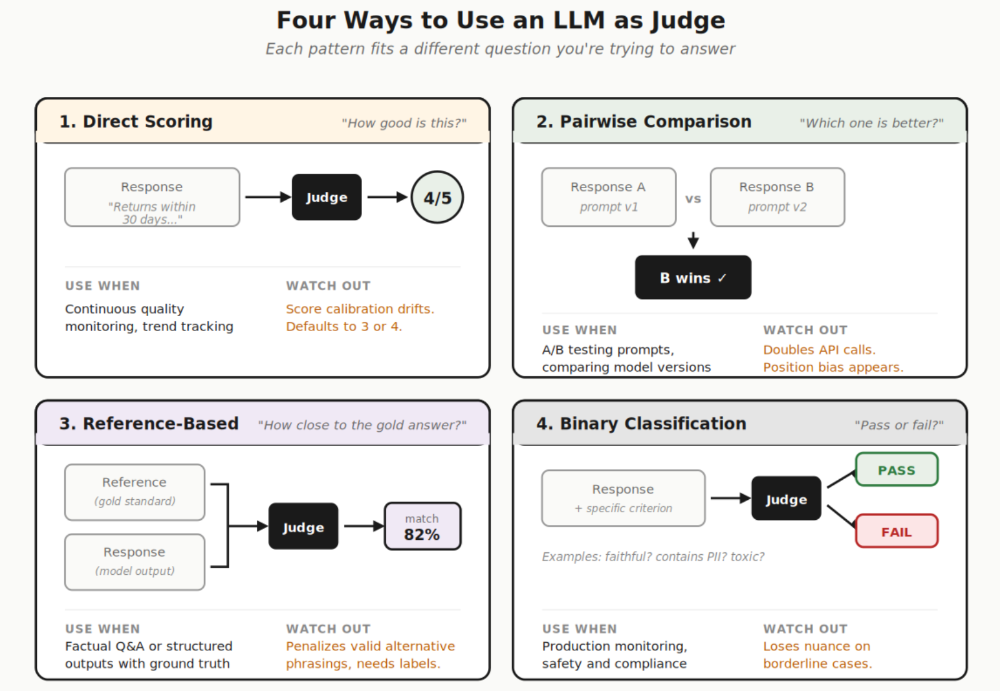

```{r load_packages, message=FALSE, warning=FALSE, include=FALSE}
library(fontawesome)
```

# Enlaces

-   `r fa("message", fill = "steelblue")` segana\@fen.uchile.cl
-   `r fa("computer", fill = "steelblue")` <https://segana.netlify.app>
-   `r fa("linkedin", fill = "steelblue")` <https://www.linkedin.com/in/sebastian-egana-santibanez/>
-   `r fa("github", fill = "steelblue")` <https://github.com/sebaegana>

------------------------------------------------------------------------

# Módulo 03

## Agentes, orquestación y automatización con n8n

### De un flujo simple a un flujo multiagente

------------------------------------------------------------------------

## Objetivo de la sesión

-   Entender cómo evoluciona un flujo desde una automatización simple hacia una arquitectura con agentes
-   Revisar en detalle dos flujos reales de n8n
-   Preparar la conexión de Google con n8n para poder operar con Sheets
-   Dejar una tercera arquitectura como extensión o bonus

------------------------------------------------------------------------

## Mapa de la sesión

La clase avanza en cinco partes:

1. problema inicial: `SQL directo vs LLM intermedio`
2. preparación técnica: `Google Cloud + n8n`
3. caso 1: `flujo simple con IA puntual`
4. caso 2: `flujo con IA orquestada`
5. cierre: `bonus y criterio de diseño`

### Idea guía

No vamos de menos a más complejidad por moda, sino para entender cuándo cada diseño tiene sentido.

------------------------------------------------------------------------

## Actividad de apertura

Pensemos en este caso organizacional:

Una empresa implementó un sistema interno para consultar bases de datos usando lenguaje natural sobre un LLM.

Ahora, cuando un analista necesita información, tiene al menos dos caminos:

-   escribir SQL directamente
-   pedirle al sistema con LLM que traduzca su intención a SQL y ejecute la consulta

### Pregunta inicial

¿Cuál de los dos caminos parece más razonable y por qué?

------------------------------------------------------------------------

## Dilema inicial

Desde el punto de vista de la empresa, la solución con LLM parece atractiva porque promete:

-   menos barrera técnica
-   interacción más simple
-   acceso más amplio
-   menor dependencia de perfiles especializados

Pero también aparecen costos:

-   más tokens
-   más ambigüedad
-   más probabilidad de error
-   menos control fino sobre la consulta
-   más dificultad para auditar qué quiso hacer realmente el usuario

------------------------------------------------------------------------

## SQL como lenguaje de trabajo

La discusión se vuelve más interesante si asumimos que SQL no es un lenguaje especialmente inaccesible.

### Hipótesis fuerte

Para muchos casos de negocio, aprender SQL básico puede ser más simple y más robusto que aprender a “promptear” bien a un sistema intermedio.

### Tensión central

¿Estamos evitando una habilidad simple a costa de introducir una arquitectura más costosa y más incierta?

------------------------------------------------------------------------

## Una capa adicional del problema

En la práctica, usar bien LLMs e IA tampoco es gratuito desde el punto de vista del aprendizaje.

Muchas veces hay que aprender:

-   a escribir mejor en `Markdown`
-   a estructurar `planes`
-   a usar `skills` o comandos de `CLI`
-   a gestionar bien el `contexto`
-   a formular instrucciones precisas y verificables

### Pregunta incómoda

¿Estamos reemplazando una habilidad relativamente simple como SQL por un conjunto nuevo de habilidades que también exige entrenamiento?

------------------------------------------------------------------------

## Costo de aprendizaje escondido

La promesa suele sonar así:

-   “no necesitas saber SQL”
-   “solo conversa con el sistema”

Pero en muchos casos el usuario termina necesitando aprender:

-   cómo pedir bien
-   cómo delimitar contexto
-   cómo estructurar una tarea
-   cómo revisar si la salida fue correcta

### Idea clave

La interfaz parece más natural, pero el trabajo cognitivo no desaparece: muchas veces solo cambia de forma.

------------------------------------------------------------------------

## Conexión con esta clase

Ese mismo criterio sirve para evaluar arquitecturas con agentes.

### Analogía

Así como no siempre conviene pasar por un LLM para llegar a SQL, tampoco siempre conviene pasar por una arquitectura más sofisticada si un flujo más simple ya resuelve el problema.

### Regla práctica

Antes de agregar inteligencia, conviene preguntarse si agrega valor neto frente a una solución más directa, incluso considerando el costo de aprendizaje para quienes usarán el sistema.

------------------------------------------------------------------------

# Parte I

## Preparación técnica: conectar Google con n8n

### Antes de construir el flujo

------------------------------------------------------------------------

## ¿Por qué partir por Google?

Porque los flujos del caso usan Google Sheets como punto de salida.

### Si esta conexión falla

-   el flujo no persiste resultados
-   no hay trazabilidad simple
-   no queda claro qué produjo el sistema

------------------------------------------------------------------------

## Paso 1: crear un proyecto en Google Cloud

Entrar a Google Cloud Console y:

-   crear un proyecto nuevo
-   asignarle un nombre reconocible
-   dejarlo como proyecto activo

### Idea clave

El proyecto es el contenedor administrativo de las APIs y credenciales.

------------------------------------------------------------------------

## Paso 2: habilitar APIs necesarias

En el proyecto, habilitar al menos:

-   `Google Sheets API`
-   `Google Drive API`

### Lectura práctica

Sheets sirve para escribir datos y Drive ayuda a resolver el documento y permisos.

------------------------------------------------------------------------

## Paso 3: configurar pantalla de consentimiento OAuth

En Google Cloud:

-   elegir tipo de usuario
-   definir nombre de la app
-   ingresar correo de soporte
-   registrar dominios si aplica

### Si es para pruebas

Puede quedar en modo testing mientras se arma el flujo.

------------------------------------------------------------------------

## Paso 4: crear credenciales OAuth

Crear un `OAuth Client ID` para aplicación web.

### Configurar

-   redirect URI entregada por n8n
-   client ID
-   client secret

### Resultado

Esos datos luego se pegan en la credencial de Google Sheets dentro de n8n.

------------------------------------------------------------------------

## Paso 5: crear la credencial en n8n

Dentro de n8n:

-   ir a `Credentials`
-   crear credencial `Google Sheets OAuth2`
-   pegar `client ID` y `client secret`
-   iniciar sesión con la cuenta autorizada

### Qué logra esto

Permite que los nodos escriban en la hoja elegida.

------------------------------------------------------------------------

## Paso 6: preparar la hoja de destino

Antes de correr el flujo conviene:

-   crear la hoja
-   definir encabezados
-   verificar que la cuenta conectada tenga acceso

### Regla práctica

Una buena automatización parte con una estructura de salida clara.

------------------------------------------------------------------------

# Parte II

## Caso 1: flujo base con automatización simple

### JSON de referencia: `Noticias de Chile.json`

------------------------------------------------------------------------

## Lectura del caso 1

### Qué entra

-   una búsqueda en Google News
-   HTML con noticias financieras

### Qué transforma

-   extracción de artículos
-   limpieza y normalización
-   análisis de sentimiento

### Qué sale

-   una tabla simple en Google Sheets

------------------------------------------------------------------------

## Qué hace el flujo 1

Este flujo:

-   busca noticias financieras
-   extrae artículos desde Google News
-   transforma resultados
-   aplica un análisis de sentimiento al título
-   guarda resultados en Google Sheets

### Lectura

Todavía no es un sistema multiagente. Es un flujo automatizado con una capa simple de IA.

### Archivo a revisar en clase

`Noticias de Chile.json`

------------------------------------------------------------------------

## Vista general del flujo 1

La secuencia es:

1. `Daily News Trigger`
2. `Fetch Google News`
3. `Extract News Articles`
4. `Code in JavaScript`
5. `Sentiment Analysis`
6. `Merge`
7. `Append row in sheet`

### Referencia

Este es el flujo importado desde `Noticias de Chile.json`.

------------------------------------------------------------------------

## Nodo 1: Daily News Trigger

Este nodo programa la ejecución diaria del flujo.

### Función

-   activar flujo manual

### Enseñanza

La automatización empieza por decidir cuándo se ejecuta una tarea.

------------------------------------------------------------------------

## Nodo 2: Fetch Google News

Este nodo consulta Google News con una búsqueda de noticias financieras.

### Función

-   pedir el HTML de la búsqueda
-   definir el universo de noticias
-   establecer el punto de entrada del dato

------------------------------------------------------------------------

## Nodo 3: Extract News Articles

Este nodo convierte el HTML en datos más estructurados.

### Extrae

-   títulos
-   links
-   fuentes
-   tiempos de publicación
-   snippets

### Idea clave

Antes de pedir análisis, conviene estructurar.

------------------------------------------------------------------------

## Nodo 4: Code in JavaScript

Aquí el flujo transforma los arrays extraídos en items individuales.

### Qué hace

-   toma títulos, links, fuentes y tiempos
-   intenta convertir tiempos relativos a formato ISO
-   devuelve un item por noticia

### Enseñanza

Este nodo es el puente entre extracción cruda y datos utilizables.

------------------------------------------------------------------------

## Nodo 5: Sentiment Analysis

Este es el primer nodo de IA del flujo 1.

### Función

-   tomar el `title`
-   estimar una categoría de sentimiento
-   enriquecer el item antes de persistirlo

### Lectura

La IA todavía cumple un rol acotado y puntual.

------------------------------------------------------------------------

## Nodo auxiliar: OpenAI Chat Model

Este nodo provee el modelo que usa `Sentiment Analysis`.

### Función

-   conectar el flujo con OpenAI
-   entregar capacidad de inferencia al nodo de sentimiento

### Idea clave

En n8n, muchas veces el modelo y la tarea están en nodos distintos.

------------------------------------------------------------------------

## Nodo 6: Merge

Este nodo combina las salidas necesarias antes de escribir en la hoja.

### Qué enseña

En flujos con IA, a veces hay que recombinar datos originales con resultados inferidos.

### Lectura práctica

No basta con obtener una inferencia; hay que integrarla de vuelta al registro.

------------------------------------------------------------------------

## Nodo 7: Append row in sheet

Este nodo persiste cada noticia en Google Sheets.

### Campos del flujo 1

-   title
-   sentiment
-   source
-   link
-   time

### Resultado

Se obtiene una tabla simple con noticias y sentimiento.

------------------------------------------------------------------------

## Qué representa el flujo 1

Representa una arquitectura de automatización con IA puntual.

### Características

-   estructura simple
-   un único análisis inferencial
-   salida corta
-   bajo costo conceptual

### Limitación

La inteligencia todavía está concentrada en una sola tarea pequeña.

------------------------------------------------------------------------

# Parte III

## Caso 2: flujo con IA orquestada

### JSON de referencia: `Noticias de Chile Orquestador.json`

------------------------------------------------------------------------

## Lectura del caso 2

### Qué entra

-   una noticia por item
-   título, fuente, link, tiempo y snippet

### Qué transforma

-   normalización del input
-   coordinación por orquestador
-   consulta a especialistas
-   consolidación estructurada

### Qué sale

-   una tabla analítica mucho más rica en Google Sheets

------------------------------------------------------------------------

## Qué cambia en el flujo 2

El segundo flujo ya no solo clasifica sentimiento.

Ahora busca producir una salida más rica:

-   categoría
-   subcategoría
-   relevancia para Chile
-   impacto estimado
-   activos afectados
-   resumen ejecutivo
-   acción sugerida

### Archivo a revisar en clase

`Noticias de Chile Orquestador.json`

------------------------------------------------------------------------

## Idea central del flujo 2

Aquí aparece una arquitectura más compleja:

-   un orquestador central
-   especialistas
-   salida estructurada

### Lectura

La tarea deja de ser una sola inferencia y pasa a ser una coordinación de análisis.

------------------------------------------------------------------------

## Vista general del flujo 2

La secuencia conceptual es:

1. trigger
2. fetch
3. extracción
4. normalización
5. orquestación
6. especialistas
7. parseo
8. persistencia

### Referencia

Este es el flujo importado desde `Noticias de Chile Orquestador.json`.

------------------------------------------------------------------------

## Nodo 1: Trigger del flujo 2

El flujo mantiene la lógica de activación:

-   ejecución manual para pruebas
-   ejecución programada para operación

### Enseñanza

La capa de activación no cambia demasiado cuando la arquitectura se vuelve más sofisticada.

------------------------------------------------------------------------

## Nodo 2: Fetch Google News Chile

El nodo de request sigue trayendo la base informacional.

### Función

-   traer el HTML
-   definir el conjunto de noticias a trabajar

### Continuidad con el flujo 1

La parte de recolección se mantiene bastante estable.

------------------------------------------------------------------------

## Nodo 3: Extract Articles

Al igual que en el flujo 1, este nodo estructura el contenido del HTML.

### Aprendizaje importante

Una buena arquitectura con agentes no reemplaza la necesidad de extracción y limpieza previa.

------------------------------------------------------------------------

## Nodo 4: Normalize Articles

Este nodo prepara una noticia por item.

### Qué hace

-   limpia textos
-   normaliza links
-   convierte tiempos relativos
-   recorta contenido
-   deduplica
-   limita cantidad de noticias

### Idea clave

El orquestador trabaja mejor cuando recibe entradas pequeñas y claras.

------------------------------------------------------------------------

## Nodo 5: Agente Orquestador

Este es el centro conceptual del flujo 2.

### Rol

-   recibe una noticia
-   decide cómo dividir el trabajo
-   consulta especialistas
-   consolida la respuesta final

### Diferencia con el flujo 1

Aquí la IA no solo analiza: coordina.

------------------------------------------------------------------------

## ¿Qué es un orquestador?

Es el agente que:

-   define la secuencia de delegación
-   distribuye subtareas
-   integra resultados parciales
-   produce un output estructurado final

### Lectura simple

No hace todo directamente, pero organiza cómo se hace.

------------------------------------------------------------------------

## Nodo especialista 1: clasificación

Este especialista responde preguntas como:

-   ¿de qué tipo de noticia se trata?
-   ¿es macroeconomía, mercados, regulación, empresas, banca o commodities?

### Salida esperada

-   `category`
-   `subcategory`
-   `classification_reason`

------------------------------------------------------------------------

## Nodo especialista 2: relevancia para Chile

Este especialista responde:

-   ¿qué tan importante es esta noticia para Chile?
-   ¿la conexión local es directa o indirecta?

### Salida esperada

-   `relevance_score`
-   `relevance_reason`

------------------------------------------------------------------------

## Nodo especialista 3: impacto de mercado

Este especialista responde:

-   ¿qué señal de sentimiento deja la noticia?
-   ¿qué activos podría impactar?
-   ¿amerita seguimiento?

### Salida esperada

-   `sentiment`
-   `impact_score`
-   `impacted_assets`
-   `summary`
-   `actionable_flag`
-   `action`
-   `confidence`
-   `notes`

------------------------------------------------------------------------

## Modelos de soporte

Cada parte de IA necesita un modelo de lenguaje conectado.

### Función

-   dar capacidad inferencial al orquestador
-   habilitar el trabajo de especialistas

### Idea clave

En una arquitectura con agentes, el modelo es capacidad; el flujo es estructura.

------------------------------------------------------------------------

## Nodo de parseo final

La salida del orquestador debe transformarse en una estructura estable antes de guardar.

### Qué hace este nodo

-   parsea JSON
-   normaliza listas
-   normaliza booleanos
-   deja el item listo para persistencia

### Enseñanza

Una salida generada por IA rara vez conviene conectarla directo a almacenamiento.

------------------------------------------------------------------------

## Nodo final: Append Row in Sheet

Aquí el flujo 2 guarda una salida mucho más rica que el flujo 1.

### Campos finales

-   run_date
-   title
-   source
-   time
-   link
-   snippet
-   category
-   subcategory
-   classification_reason
-   relevance_score
-   relevance_reason
-   sentiment
-   impact_score
-   impacted_assets
-   summary
-   actionable_flag
-   action
-   confidence
-   notes

------------------------------------------------------------------------

## Comparación entre flujo 1 y flujo 2

### Flujo 1

-   simple
-   una inferencia puntual
-   salida corta
-   más fácil de explicar y operar

### Flujo 2

-   más rico analíticamente
-   más modular
-   más costoso
-   más exigente en diseño

------------------------------------------------------------------------

## Qué enseña esta comparación

La evolución no es solo “más IA”.

### En realidad es

-   más estructura
-   más roles
-   más coordinación
-   más necesidad de claridad en inputs y outputs

### Regla práctica

Cada capa adicional debe justificarse.

------------------------------------------------------------------------

## Criterio de decisión: flujo 1 vs flujo 2

### Me quedo en flujo 1 cuando

-   necesito una automatización rápida
-   la salida esperada es corta
-   el costo y la simplicidad importan más
-   una sola inferencia puntual es suficiente

### Paso a flujo 2 cuando

-   necesito varias capas de análisis
-   importa separar roles analíticos
-   quiero una salida más rica y reusable
-   la organización tolera más complejidad operativa

------------------------------------------------------------------------

## Qué mirar en cada diseño

Para comparar ambos flujos conviene mirar cuatro criterios:

-   `simplicidad`
-   `costo`
-   `control`
-   `valor agregado`

### Regla práctica

La mejor arquitectura no es la más sofisticada, sino la que entrega el valor necesario con un costo razonable.

------------------------------------------------------------------------

# Parte IV

## Bonus: tercera variante con supervisor y herramientas

### Dejar como extensión final

------------------------------------------------------------------------

## Qué es la variante bonus

En vez de usar especialistas conversacionales, un supervisor puede coordinar herramientas más determinísticas.

### Ejemplos

-   reglas de clasificación
-   scoring
-   subworkflows
-   validaciones
-   escritura directa a sistemas

### Idea

No toda delegación tiene que ir a otro agente.

------------------------------------------------------------------------

## Cuándo mirar esta tercera variante

Cuando queremos:

-   más control
-   menos dependencia de subagentes
-   más trazabilidad operativa
-   una mezcla entre supervisión e instrumentación

### Para esta clase

La dejamos como bonus, no como flujo principal.

### JSON asociado

`Noticias de Chile Supervisor Herramientas.json`

------------------------------------------------------------------------

## Resumen operativo {.smaller}

-   primero discutimos cuándo una capa de IA agrega valor
-   luego preparamos la conexión con Google
-   después revisamos un flujo simple con análisis puntual
-   luego estudiamos un flujo con IA orquestada y especialistas
-   finalmente dejamos una tercera variante como extensión

### Pregunta final

¿Qué parte del diseño agrega más valor en cada caso: el modelo, el flujo o la forma de integrar ambos?

------------------------------------------------------------------------

## Actividad de cierre {.smaller}

### Caso

Una organización quiere monitorear noticias regulatorias y de mercado para apoyar decisiones internas.

### Tarea

Cada grupo debe decidir qué arquitectura usaría como punto de partida:

1. un flujo simple con IA puntual
2. un flujo con orquestador y especialistas
3. un supervisor con herramientas como evolución futura

------------------------------------------------------------------------

## Instrucciones de trabajo {.smaller}

Cada grupo debe responder:

1. ¿Con cuál flujo partirían?
2. ¿Qué ganan con esa elección?
3. ¿Qué perderían si adoptan una arquitectura más simple?
4. ¿Qué condición debería cumplirse para pasar al siguiente nivel?

### Regla

No basta con elegir el flujo más sofisticado: hay que justificar el momento correcto para usarlo.

------------------------------------------------------------------------

## Cierre de la clase

Entender estos flujos ayuda a leer mejor tres cosas:

-   cómo diseñar automatizaciones con LLMs
-   cómo separar funciones dentro de una arquitectura
-   cómo decidir cuándo una capa adicional sí vale la pena

------------------------------------------------------------------------

## Ejemplo final: LLM as a Judge

Como cierre, conviene mirar un caso relacionado pero distinto:

-   usar un LLM no para ejecutar un flujo
-   sino para evaluar respuestas, compararlas o clasificarlas

### Referencia

<https://www.datacamp.com/tutorial/llm-as-a-judge-rag>

------------------------------------------------------------------------

## Cuatro formas de usar un LLM como juez {.smaller}



### Lectura rápida

-   `Direct scoring`
-   `Pairwise comparison`
-   `Reference-based`
-   `Binary classification`

------------------------------------------------------------------------

## ¿Por qué dejar este ejemplo al final?

Porque muestra una extensión natural de la misma lógica vista en clase:

-   no solo usamos LLMs para generar
-   también podemos usarlos para evaluar
-   y eso abre nuevas decisiones de diseño en sistemas con IA

### Conexión con la sesión

Así como discutimos cuándo conviene agregar un orquestador, aquí también habría que preguntarse cuándo conviene usar un LLM como juez y cuándo no.

------------------------------------------------------------------------

## Criterio de éxito

Si al terminar puedes explicar:

-   cómo conectar Google con n8n para este caso
-   qué hace cada nodo del flujo 1
-   qué cambia conceptualmente en el flujo 2
-   y por qué la tercera variante puede quedar como bonus

entonces la sesión cumplió su objetivo.

------------------------------------------------------------------------
